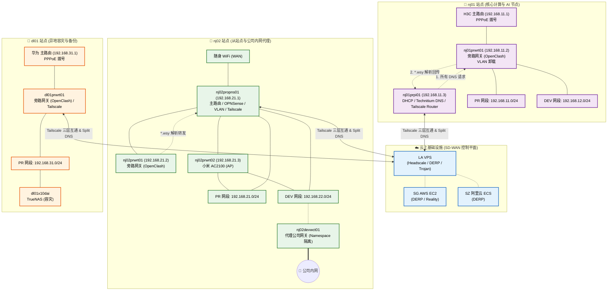

   <h1>Hi there, I'm Shuyang  </h1>

<h3>  💻 Infra | DevOps Engineer </h3>

 

 
 
 
 

- Into HomeLab and Self-Hosted services.

- Try to automate All my work into CI/CD pipeline.

- I do DevSecOps, Infra and a bit of everything :heart:

- As heaven's movement is ever vigorous, so must a gentleman ceaselessly strive along.

- btw I use CachyOS. 

 
 
 
 

 

 

### Academic Ability
- Invention Patent: [一种多终端多无人机分层调度辅助边缘计算资源分配方法](https://cpquery.cponline.cnipa.gov.cn/detail/index?zhuanlisqh=8x5aXikTaWvidHSvrrUcbg%253D%253D&anjianbh&searchType=1)
- IEEE Paper: [Optimization of energy consumption with hybrid cooperative NOMA for secure MEC](https://ieeexplore.ieee.org/document/10062073)

### Engineering Ability
#### HomeLab Overview

#### HomeLab Network Logic Architecture

### Tech Stack

---

#### Languages & Env

  
  
  
  
  
  
  
  

#### Cloud

  
  
  
  
  
  
  

#### IaaS & PaaS

  
  
  
  
  
  
  

